# 🌐 Linux Apache Webserver Modsecurity (WA) with OWASP Core Rule Sets (CRS)

This project lab walks through installing and verifying a working Apache web server on a Linux system (Debian-based distros like Ubuntu or Kali). The guide also walks through installing ModSecurity, enabling it on Apache2, and integrating the OWASP Core Rule Set (CRS) to provide a Web Application Firewall (WAF) for your server.

---

## 📦 What This Project Covers

- Installing Apache using APT
- Starting and enabling the Apache service
- Verifying that the default page loads on `http://localhost`
- Managing Apache as a system service (`systemctl`)
- Checking network config with `ip a`
- Apache2 protected by ModSecurity
- OWASP Core Rule Set enabled
- Logging and active blocking

---

## 🚀 How to Run

### 1️⃣ Install and Verify Apache
Install Apache:
```bash
sudo apt install apache2 -y
```
✅ Check Apache status:
```bash
sudo systemctl status apache2
```
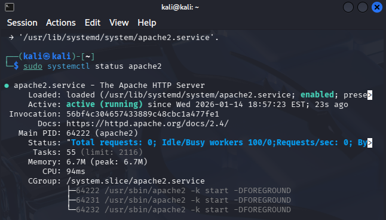

Then go to:
- `http://localhost`
- or your Kali IP shown by `ip a`
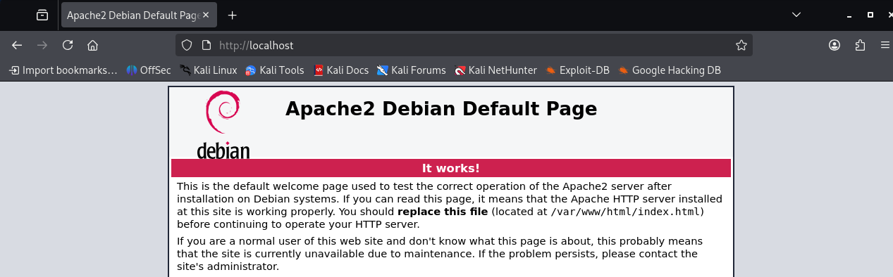
---

### 2️⃣ Install ModSecurity
This install Modsecurity and the Apache Module:
```bash
sudo apt install libapache2-mod-security2 -y
```
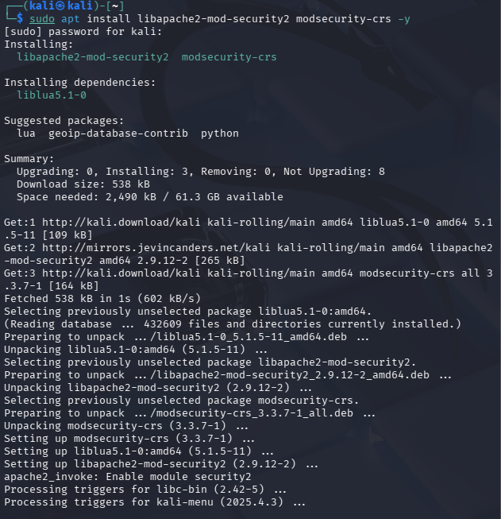

Enable required Apache modules:
```bash
sudo a2enmod security2
sudo a2enmod headers
```
Restart Apache:
```bash
sudo systemctl restart apache2
```
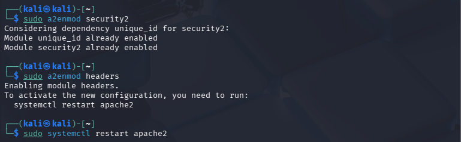

---
### 3️⃣ Enable ModSecurity Engine
Activate the recommended ModSecurity configuration:
```bash
sudo cp /etc/modsecurity/modsecurity.conf-recommended \
        /etc/modsecurity/modsecurity.conf
```
Edit the configuration:
```bash
sudo nano /etc/modsecurity/modsecurity.conf
```
Set the engine mode:
```bash
SecRuleEngine: On
```
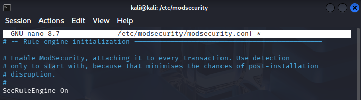

Save and exit.

---
### 4️⃣ Download and Install OWASP CRS 
Create a directory for CRS:
```bash
sudo mkdir -p /etc/apache2/modsec
```
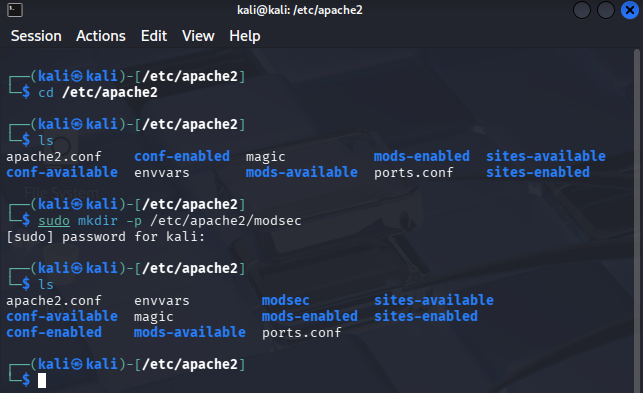

📥 Clone the OWASP-CRS GitHub repository into the `/etc/apache2/modsec directory`:
```bash
sudo git clone https://github.com/coreruleset/coreruleset /etc/apache2/modsec
```
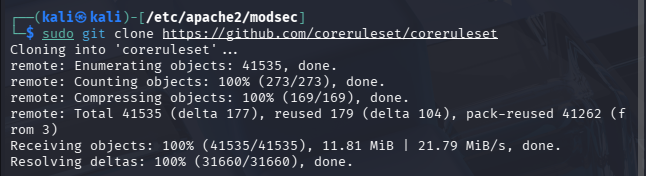

💡 I changed the file name `coreruleset` to `crs`:


Rename the `crs-setup.conf`.example to `crs-setup.conf`:
```bash
sudo mv /etc/apache2/modsec/crs/crs-setup.conf.example /etc/apache2/modsec/crs/crs-setup.conf
```
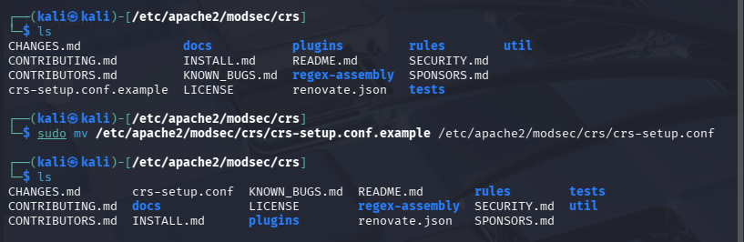

---
### 5️⃣ Include CRS in Apache 
Edit the ModSecurity Apache config:
```bash
sudo nano /etc/apache2/mods-enabled/security2.conf
```
Add the following before `</IfModule>`:
```apache
# OWASP Core Rule Set
Include /etc/apache2/modsec/crs/crs-setup.conf
Include /etc/apache2/modsec/crs/rules/*.conf
```
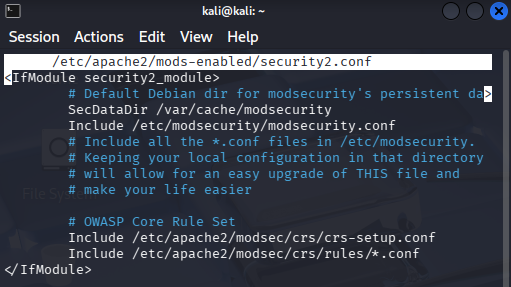

Save and exit.

---
### 6️⃣ Test & Restart Apache
Test Apache configuration:
```bash
sudo apache2ctl -t
```
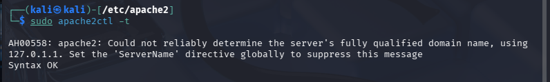

✅ Verify the message output of `Syntax Ok`

---
### 7️⃣ Verify CRS Is Working 
Test with a malicious-looking request:
```bash
curl localhost/index.html?exec=/bin/bash
```
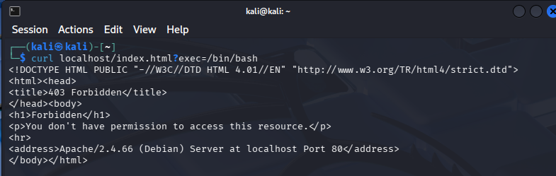

💡 Notice the `403 Forbidden`. This means `ModSecurity` has been configured correctly and is actively blocking attacks.

Let's check the `ModSecurity` logs:
```bash
sudo cat /var/log/apache2/modsec_audit.log
```
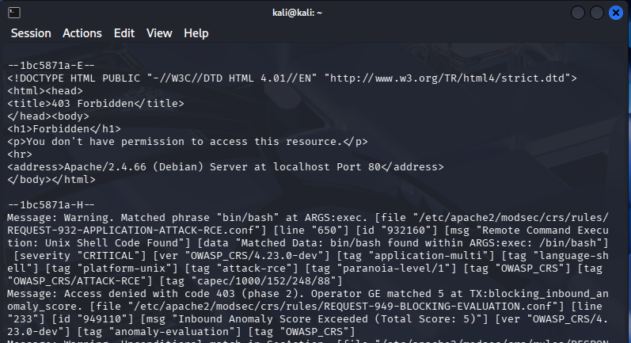

This provides strong baseline protection against:

✅ SQL Injection

✅ XSS

✅ Command Injection

✅ Path Traversal

✅ Protocol violations

---

## 🛠 Tools Used

- apache2
- bash
- git
- apt
- systemctl
- ip

---
