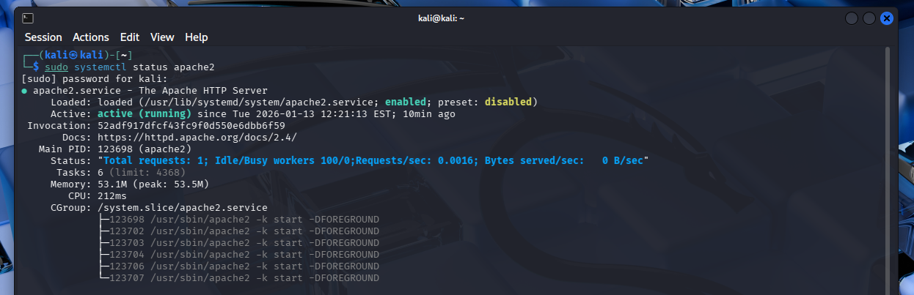
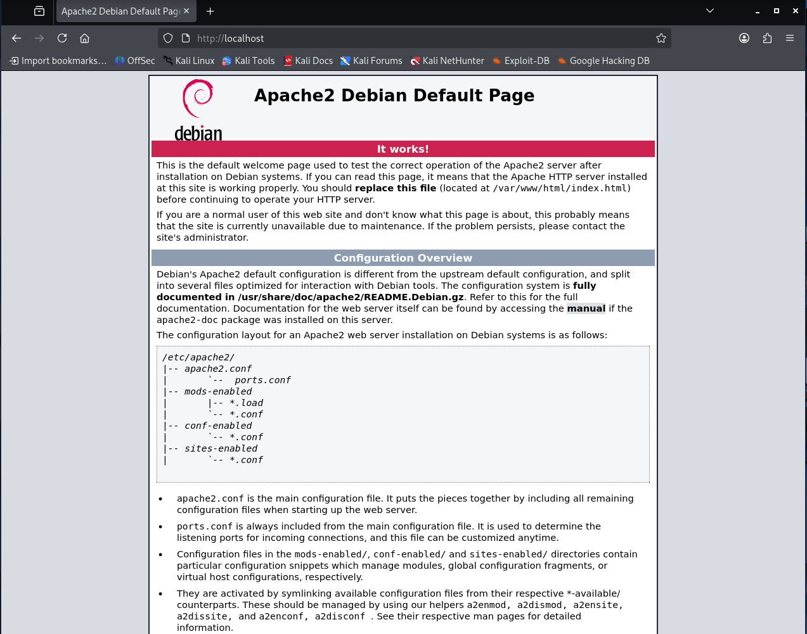

# 🌐 Linux Apache Webserver

This lab walks through installing and verifying a working Apache web server on a Linux system (Debian-based distros like Ubuntu or Kali).

---

## 📦 What This Lab Covers

- Installing Apache using APT
- Starting and enabling the Apache service
- Verifying that the default page loads on `http://localhost`
- Managing Apache as a system service (`systemctl`)
- Checking network config with `ip a`

---

## 🚀 How to Run

```bash
sudo apt install apache2 -y
```

Then go to:

- `http://localhost`
- or your Kali IP shown by `ip a`

---

## 📸 Screenshots

### 1️⃣ Apache Service Status


---

### 2️⃣ Apache Browser Default Page 


---

### 3️⃣ Apache Browser Default Page  


---

### 4️⃣ Kali Network IP Configuration  


---

## 🛠 Tools Used

- apache2
- bash
- apt
- systemctl
- ip

---

## ✅ Ideal For

- Linux beginners
- IT support or sysadmin labs
- Local hosting and web service practice
